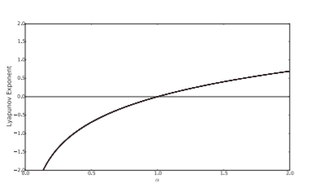
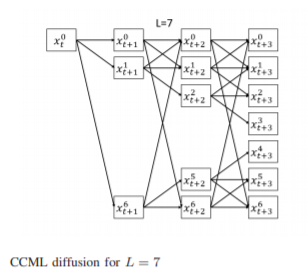
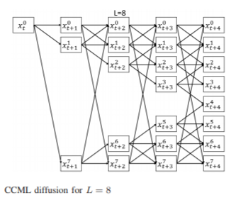
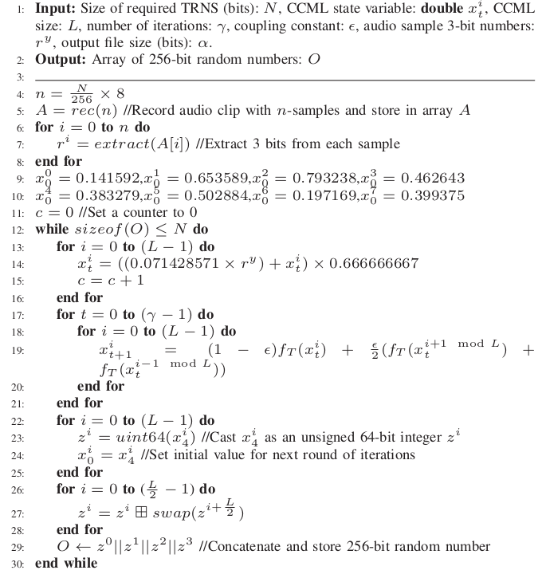
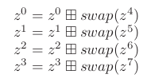
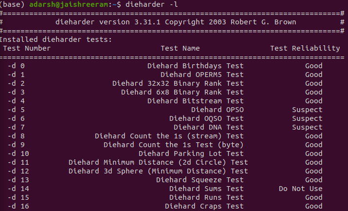
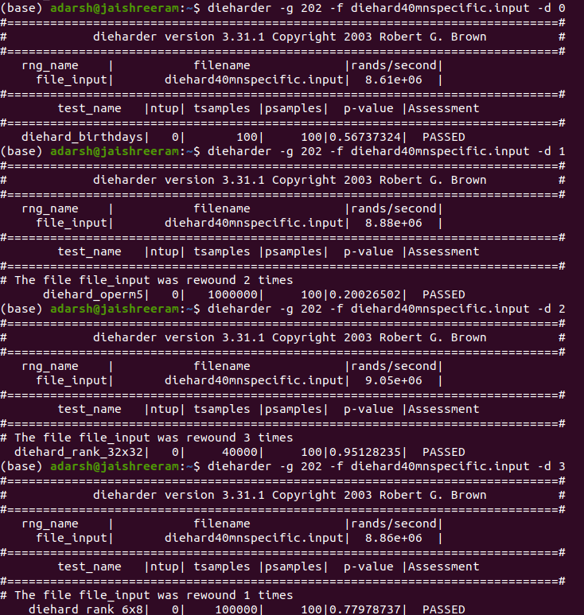
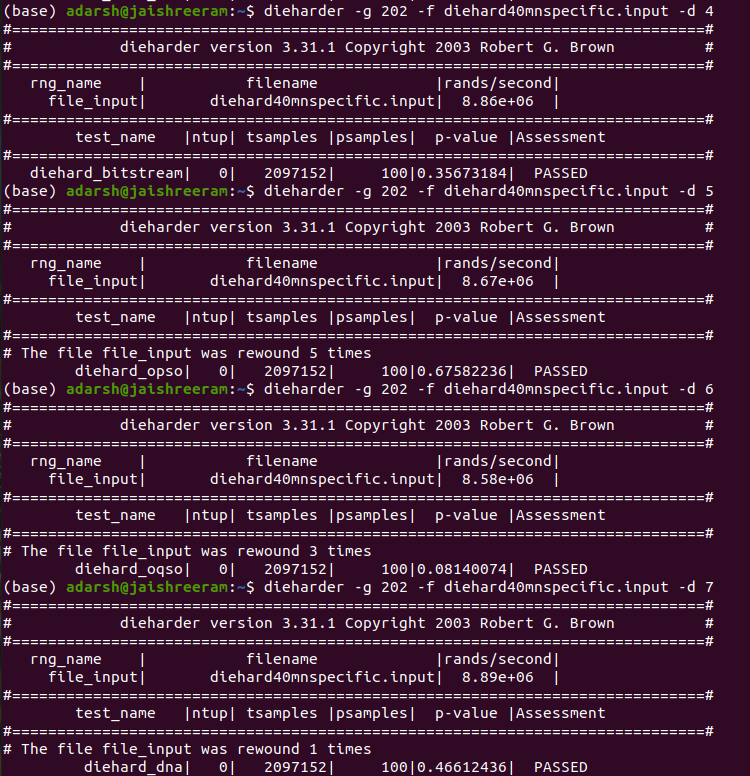
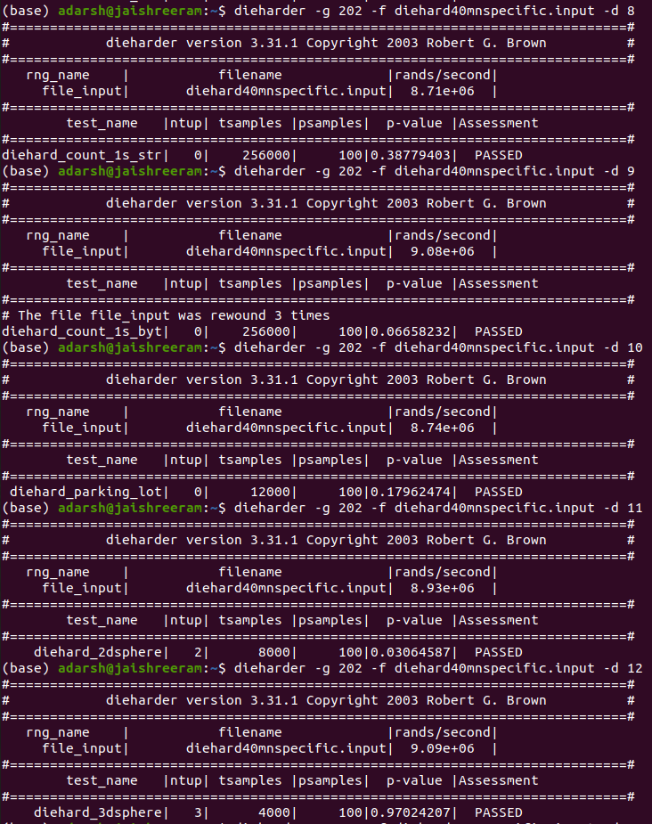
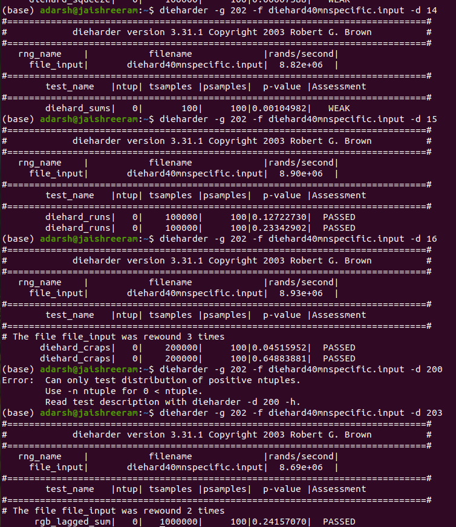

# Random Numbers 
There is always a high demand for random numbers for different uses 
like gambling , cryptography, encryption and many more.
There are many process which are random in their true nature for example rolling a die or tossing
an unbiased coin.These physical/ mechanincal process produce true random results but require lot of
time.<br>

Random number generators(RNG) are used to generate random numbers.
Random Number generators(RNG) can be divided into two main categories<br>
1. PseudoRandom Number Generators (PRNG)<br>
2. True Random Number Generators(TRNG)<br>

# PseudoRandom Number Generators(PRNG)

PRNG use a seed value to generate random-like sequences mathematically. However PRNG will always
produce same result for same seed.They are deterministic but appear to be random. PRNG is used in 
few game developements. Since true randomness cannot be generated using a computer which follows 
the instruction of the user,external randomness needs to be harnessed.

# True Random Number Generators(TRNG)
TRNG play an important role in many fields that require unpredictable and nondeterministic random
number sequences. Unlike PRNGs, TRNGs are more computationally expensive as they need to harness 
entropy from physical phenonmenona.<br>
To generate high quality true random numbers at a fast rate, this project uses hyperchaotic map
such as sensitivity to initial conditions and complex behavior amplifies noise obtained by sampling 
environmental sound through a computer microphone.<br>
Entropy tests are done to proves nondeterminism .

# Chaos Theory 
A mathematical system that depicts aperiodicity ,sensitivity ,ergodicity ,diffusion and confusion 
characterstics and fulfils the requirement of cryptographic algorithms is called a chaotic system.

A popular chaotic tent map which maps the interval [0,1] onto itself :<br>


<br>
The behavoir of this chaotic map can be determined by its control parameter 
<br>

 . As   
moves from 0 to 2 the chaotic map changes from periodic to aperiodic as shown by the 
Lyapunov exponent of the chaotic temp map. Lyapunov exponent indicates chaotic behavoir in the 
region where it is positive.
<br>


<br> 
The code below shows the Chaotic map used in this TRNG


<br> 
The chaotic system used in this TRNG is spatiotemporal chaotic system known as coupled chaotic map 
lattice ( CCML ). Compared to unimodel Chaotic Maps like the tent map , the CCML has longer periodic length,higher comlexity and has multiple positive Lyapunov exponents. Such a system with multiple positive lyapunov exponent is called hyperchaotic.<br>

The CCML equation is :<br>


where  is a coupling constant , i ={1,2,3,,L} is the local index and L is the size of the system and f(x) is the local chaotic map . 
In this design this local chaotic map has control parameter 
 = 1.9999 and CCMl coupling constant 
  = 0.05


```python
def chaotic_map(x):
    alpha =1.99999
    if x<0.5:
        return (alpha* x);
    return (alpha*(1-x));
```


For a single chaotic state to affect all other states, a total
of floor(L/2) iterations are required, where the floor(y) function
rounds y downwards and returns the largest integral value that
is not greater than y. Examples for L = 7 and L = 8 are


<br>


<br>


# Audio Sampling 
The souce of randomness in this TRNG is ambient sound which is recorded by a microphone and 
digitized. Recording are obtained using the microphone in the system and it has sampling rate of 
44.1 kHz . Each sample is then stored as 8 bit variables .

In order to remove transient effect the first 1000 samples are discarded. 
Add offset value 127 to all the values so that number lie in the range of [0,255].<br>
3 least significant bit from each number is taken.

# Algorithm 


<br>

The CCML states  are represented in 64 bit IEEE double-precision
binary floating point format.The chaotic states are intialized using the 3bit sample from audio.
The interval between each perturbation operation is selected based on the number of rounds required to diffuse the
bits in one state to all eight states. For L = 8, the number of
rounds required is 8/2 = 4, therefore perturbation of the
x it only occurs once every four iterations. The value of x it is
modified based on the equation : <br>

 
<br>
where  is the value of 3-bit random number obtained from the y-th audio sample. This equation chosen such that value of lis in the range of [0,1].
The states for the CCML, , i = {0, , 7} are initialized
with the arbitrary FP values (0.141592, 0.653589, 0.793238,
0.462643, 0.383279, 0.502884, 0.197169, 0.399375)

Z is an numpy array which stores the value of all final eight states. The value of the Z are used to produce four 64 bit numbers.
based on : <br>


<br>

The swap funciton swaps the 32 most significant bits with the 32 least significant bits.By performing the swap followed by an
XOR operation, the TRNG makes full use of the entire 64-bit values to produce outputs.
O is resultant random sequence. 
```python
o=[]
z=[0 for i in range(L)]

x = [[0 for i in range(epoch)] for j in range(L)]
x[0][0] = 0.141592
x[1][0] = 0.653589
x[2][0] = 0.793238
x[3][0] = 0.462643
x[4][0]= 0.383279
x[5][0]= 0.502884
x[6][0] = 0.197169
x[7][0] = 0.399375
t=0
c=0
y=0
while len(o)<= N:
    t=0
    
    for i in range(L):
        x[i][t]= float(((0.071428571 * (r[c]%8)) +x[i][t]) * 0.666666667)
        c  = c + 1
    for t in range (epoch):
        for i in range(L):
            x[i][(t+1)%epoch] = (1-cc)*x[i][t] + (cc/2)* (x[(i+1)%L][t]+ x[(i-1)%L][t])                    
    for i in range(L):
        z[i]= int(x[i][4]*(10**8) )%(2**64)
        x[i][0]= x[i][4]
        
    for i in range(int(L/2)):
        k=(z[i+4])
        swapped_k= ( (k<<(32))   | k>>(32) )
        z[i]= (z[i] ^ swapped_k)
        z[i]= (z[i])%(2**64)
    newnum = ( ( (  z[0] << 64  | z[1] ) << 64 | z[2] ) << 64 | z[3] )
    o.append(newnum)
```
# Statistical Test Results


<br>

The TRNG is evaluated on the DIEHARD test suite. (yipee ka aye)
The DIEHARD test suite has 18 statistical tests and the TRNG passed all the tests.



<br>


<br>


<br>


<br>


